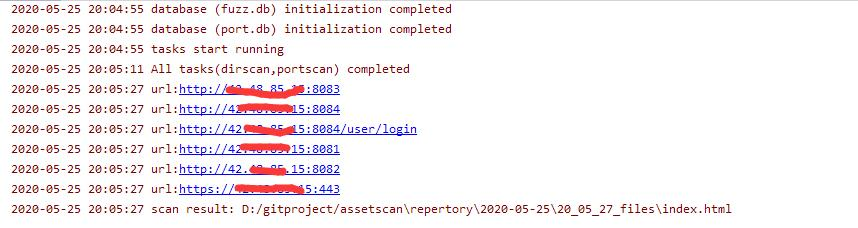
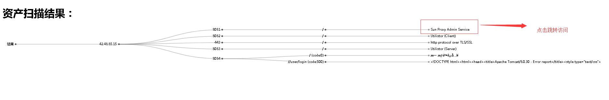

# assetscan
资产扫描工具
```
Usage: Main.py [options]

Options:
  -h, --help            show this help message and exit
  -i IPSCOPE, --ipscope=IPSCOPE
                        Specify IP scan range,eg: 127.0.0.1/24 or
                        10.65.10.3-10.65.10.255
  -p PORTSCOPE, --portscope=PORTSCOPE
                        Specify Port scan range,eg: 80,443,8080 or web_ports
                        or top_100 or top_1000
  -m SCANMODE, --scanmode=SCANMODE
                        Scan mode[fast,low],default:fast
  -f FILE, --file=FILE  asset's file
  -t, --task-run        Start in task mode,default cmd run
```
###参数介绍
```
ipscope   为指定扫描范围，格式如下 10.0.0.1/24 或者 10.0.0.1-255 或者 10.0.0.1-10.0.0.255
portscope 为指定扫描端口，系统提供web_ports,top_100,top_1000三大类，形式如下：
          1.python Main.py -i 10.0.0.1/24 -p 80,443,8080
          2.python Main.py -i 10.0.0.1/24 -p 80,8080-10000
          3.python Main.py -i 10.0.0.1/24 -p web_ports
scanmode  为指定扫描模式，默认情况下是fast模式，由于有些内网权限非root，所以此时建议采用慢模式扫描
file      为指定文件进行批量扫描
task-run  为任务模式扫描，此时任务模式采用多进程多线程模式，会一并扫描目录模块
```
###二进制bin目录

chmod 777 ./bin -R

###扫描console信息如下



###生成的报表信息如下


